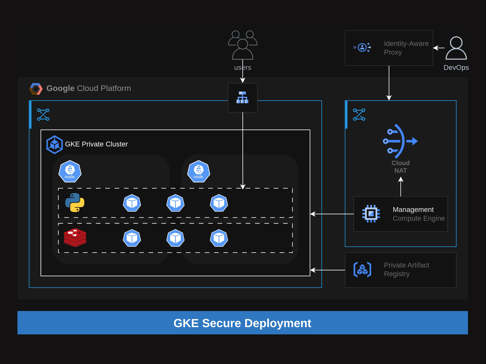

# GKE Secure Deployment

## Project Overview

This repository provides an implementation for securely deploying a Python web application with a Redis backend on Google Kubernetes Engine (GKE). The solution emphasizes private networking, least-privilege access, and persistent storage for stateful workloads, following Google Cloud Platform (GCP) security best practices.

---

## Architecture



The deployment consists of the following core components:

- **Python Application**: Containerized Tornado-based web app, deployed as a Kubernetes Deployment.
- **Redis Database**: Deployed as a Kubernetes StatefulSet with persistent storage.
- **Networking**: All workloads run in a private GKE cluster and the application is exposed externally via LoadBalancer.
- **Infrastructure as Code**: All infrastructure is provisioned using Terraform modules for repeatability and auditability.

---

## Prerequisites

- **Google Cloud Platform** account with billing enabled
- [gcloud CLI](https://cloud.google.com/sdk/docs/install) authenticated (`gcloud auth login`)
- [kubectl](https://kubernetes.io/docs/tasks/tools/) configured for your GKE cluster
- [Docker](https://docs.docker.com/get-docker/) for building images
- [Terraform](https://www.terraform.io/downloads) for infrastructure provisioning

---

## Deployment Steps

### 1. Clone the Repository

```bash
git clone https://github.com/your-org/gke-secure-deployment.git
cd gke-secure-deployment
```

### 2. Configure Environment

- Edit `Terraform/terraform.tfvars` with your GCP project and region.
- Ensure your public IP is set in `Terraform/variables.tf` if using master authorized networks.

### 3. Provision Infrastructure

```bash
cd Terraform
terraform init
terraform apply
```

This will create:
- VPC, subnets, and firewall rules
- Private GKE cluster and node pool
- Artifact Registry for container images
- Management VM for secure access

### 4. Build and Push Docker Images

Build and push your application and Redis images to Artifact Registry:

```bash
# Authenticate Docker to Artifact Registry
gcloud auth configure-docker us-central1-docker.pkg.dev

# Build and push Python app
docker build -t us-central1-docker.pkg.dev/<PROJECT_ID>/cluster-private-repo/python-app ./App
docker push us-central1-docker.pkg.dev/<PROJECT_ID>/cluster-private-repo/python-app

# Tag and push Redis
docker tag redis us-central1-docker.pkg.dev/<PROJECT_ID>/cluster-private-repo/redis redis
docker push us-central1-docker.pkg.dev/<PROJECT_ID>/cluster-private-repo/redis
```

### 5. Deploy Kubernetes Manifests

```bash
kubectl apply -f Manifests/statefulsets.yaml
kubectl apply -f Manifests/deployments.yaml
kubectl apply -f Manifests/services.yaml
```

---

## Kubernetes Configuration Details

- **Python App**:  
  - Deployment with 3 replicas  
  - Exposed via LoadBalancer on port 80  
  - Environment variables for Redis connection

- **Redis**:  
  - StatefulSet with 1 replica (scalable)  
  - PersistentVolumeClaim for data durability  
  - Headless Service (`clusterIP: None`) for stable DNS

- **Networking**:  
  - App is externally accessible; Redis is internal-only  
  - Private nodes, master authorized networks, and NAT for egress

---

## Security Considerations

- GKE cluster is private, nodes have no public IPs
- Master authorized networks restrict access to the Kubernetes API
- Service accounts follow least-privilege principle
- Redis is not exposed outside the cluster

---

**Author:** Muhamad Mamoun